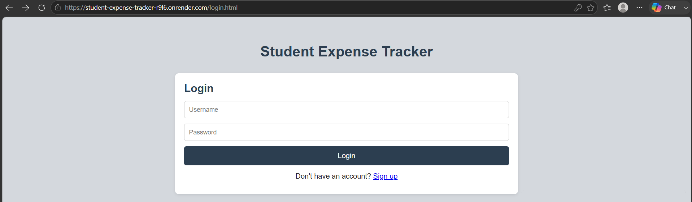
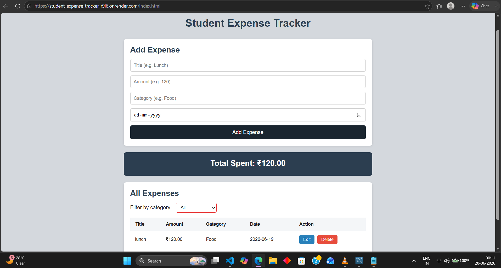

# Student Expense Tracker

A full stack web application for students to track their daily expenses.

## Live Demo
[View Live App](https://student-expense-tracker-r916.onrender.com)

> Note: Free tier hosting may take 30–60 seconds to wake up on first visit.

## Screenshots



## Tech Stack
- **Frontend:** HTML, CSS, Vanilla JavaScript
- **Backend:** Node.js, Express.js
- **Database:** MySQL (Aiven)
- **Auth:** bcrypt, express-session
- **Deployment:** Render

## Features
- User authentication (signup/login/logout) with hashed passwords
- Full CRUD — add, edit, delete expenses
- Filter expenses by category
- Real-time total expense calculation
- Mobile responsive design
- Toast notifications for user feedback
- Input validation on frontend and backend

## API Routes
| Method | Route | Description | Auth Required |
|--------|-------|-------------|---------------|
| POST | /auth/signup | Create account | No |
| POST | /auth/login | Login | No |
| POST | /auth/logout | Logout | Yes |
| GET | /auth/me | Check session | No |
| GET | /expenses | Get all expenses (supports ?category filter) | Yes |
| POST | /expenses | Add expense | Yes |
| PUT | /expenses/:id | Update expense | Yes |
| DELETE | /expenses/:id | Delete expense | Yes |
| GET | /expenses/total | Get total expenses | Yes |

## Local Setup
1. Clone the repo
```bash
   git clone https://github.com/ramm037/student-expense-tracker.git
   cd student-expense-tracker
```
2. Install dependencies
```bash
   npm install
```
3. Create a `.env` file in the root:
DB_HOST=your_mysql_host

DB_PORT=your_mysql_port

DB_USER=your_mysql_user

DB_PASSWORD=your_mysql_password

DB_NAME=your_database_name

SESSION_SECRET=your_secret_key

4. Set up the database schema (see `/schema.sql` or run the CREATE TABLE statements in the project)
5. Start the server
```bash
   npm run dev
```
6. Open `http://localhost:3000`